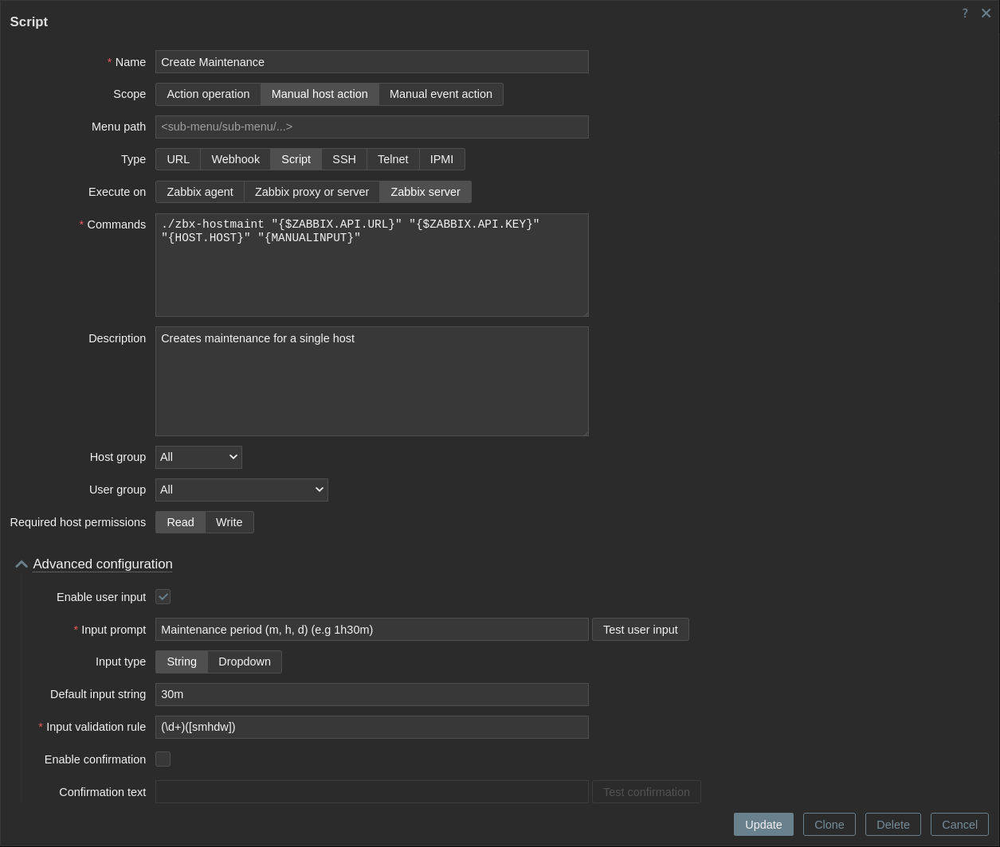

## Quick Host Maintenance for Zabbix

This is a script to perform a manual host action in Zabbix (7.0+). It makes creating maintenance windows for single hosts easier.  
The maintenance window starts immediately and ends at a user-defined time.

Setup:
* Place the latest release in the `externalscripts` folder in the Zabbix instance (usually `/lib/zabbix/externalscripts`)
  > Make sure the `zabbix` user can execute it
* Create a new script item in Zabbix (Alerts > Scripts) that executes the program
* The program requires 4 additional arguments (enclosed in quotation marks)
  1. Zabbix API URL (e.g `https://example.com/zabbix/api_jsonrpc.php`)
  2. API Key 
  3. Technical host name (via built-in macro `{HOST.HOST}`) 
  4. Maintenance period (via {MANUALINPUT} macro)
  > It's recommended to pass the API key via a global macro

---

Here's an example of the script configuration:

> **NOTE:** The Input validation rule `(\d+)([smhdw])` is regex validation that verifies user input.

The script supports scheduling maintenance for minutes (m), hours (h), days (d) or weeks (w). They can also be combined for a more precise timeframe (e.g. `1h30m`).

Troubleshooting:

When using SELinux, it could prevent the script from executing:

* SELinux context is likely wrong (check with: `ls -Z path/to/externalscripts/zbx-hostmaint`)

    Fix it with:  
    `chcon -t zabbix_script_exec_t /path/to/externalscripts/zbx-hostmaint`